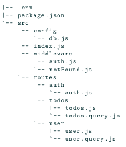

# EpyTODO
### An ASM Studios production

=======

## Description
EpyTODO project aim to the creation of an API interacting with a database.

Here is the recommended repository's structure used for this project (without bonuses) :



## Install and Run the project
### Requirements
> - [NodeJS](https://nodejs.org/en/download/package-manager/)
> - [MySQL](https://dev.mysql.com/doc/mysql-installation-excerpt/5.7/en/) or [MariaDB](https://www.mariadbtutorial.com/getting-started/install-mariadb/)
> - [PhpMyAdmin](https://docs.phpmyadmin.net/en/latest/setup.html) (optional, if you want to view your database)

---

To use the EpyTodo, you need to install the dependencies and launch it locally on your PC.

*Clone the project:*
```
git clone git@github.com:ASM-Studios/ASM-EpyTODO.git

cd EpyTODO
```

*Install all dependencies:*
```
npm install
```

*Create the database:*
```
cat epytodo.sql | mysql -u root -p
```

*Setup the .env*<br/>
```
cp utils/.env.example .env
```
> Update the .env file with your information

*Run the project:*
```
npm start
```

Enjoy !

---

## Utils
> Inside the utils/ folder you will find
> - '.env.example' An example of the .env file
> - 'epytodoReset.sql' An sql script to reset the database

---
### REPORTING BUGS:
> There is no bug

---
# THE TEAM:

| [<br><sub>Maël RABOT</sub>](https://github.com/Mael-RABOT) | [<br><sub>Axel CHYPRE</sub>](https://github.com/Cadavre-chan) | [<br><sub>Adrien AUDRIAD</sub>](https://github.com/Popochounet) |
|:---:|:---:|:--------------------------------------------------------------------------------------------------------------------------:|

<br/><br/>


